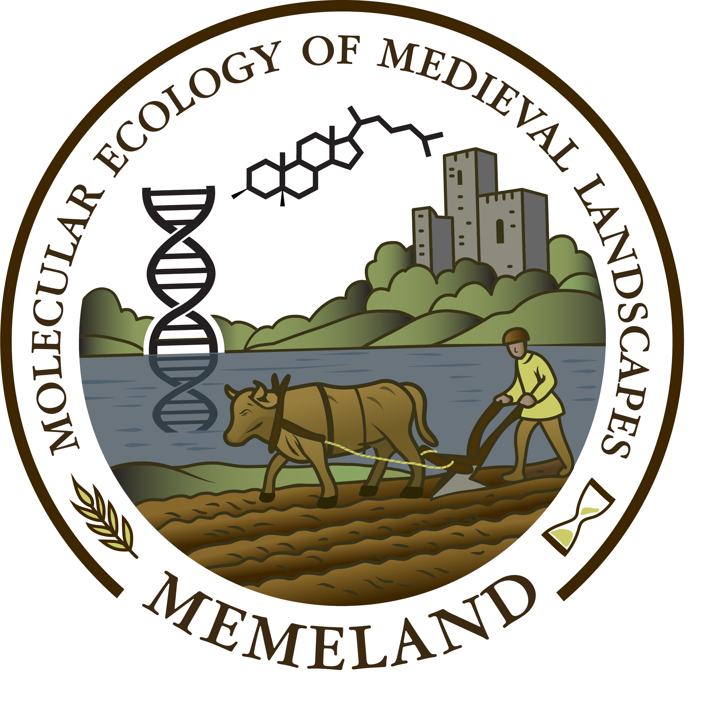

:::: {.columns}

::: {.column width="32%"}
:::

::: {.column width="36%"}

# À propos du projet
:::

::: {.column width="32%"}
:::

::::

Les paysages européens sont des hybrides culturels-naturels : les schémas actuels de biodiversité n'ont pas seulement été façonnés par le climat et l'écologie, mais aussi par des siècles d'utilisation humaine des terres, de gouvernance et d'idéologie. MEMELAND comble une lacune centrale dans notre compréhension de cet héritage en reconstruisant les trajectoires de biodiversité et d'utilisation des terres au niveau des espèces sur les deux derniers millénaires — précisément la période durant laquelle de nombreux systèmes préhistoriques des plaines ont été remplacés par des paysages médiévaux et modernes.

Pour ce faire, MEMELAND intègre des proxies moléculaires de pointe avec des approches archéologiques et paléoécologiques établies. Nous analysons des carottes sédimentaires de 50 lacs *appariés* (100 sites) : un site situé près d'une archéologie médiévale d'élite documentée et un site de contrôle voisin avec peu ou pas de signal archéologique comparable. Cette stratégie de sites appariés nous permet de dissocier la variabilité locale des tendances régionales et de tester des hypothèses sur la "révolution agricole médiévale", les changements de population, les technologies (par ex., la charrue à versoir) et l'évolution des régimes de gestion des terres.

Le projet est une collaboration Synergy dirigée depuis l'Université arctique de Norvège, avec l'Université d'Oxford, l'Institut fédéral suisse des sciences et technologies aquatiques (Eawag) et l'Université de Salzbourg, ainsi que le partenaire Université Charles de Prague. Parallèlement aux publications scientifiques, MEMELAND s'engage pour la science ouverte et la restitution des résultats site par site aux collaborateurs locaux. Voir [Équipes de recherche](#equipes-de-recherche) et [Personnes](/Team/people.qmd) pour plus d'informations.

# Équipes de recherche

Le projet MEMELAND comprend 5 équipes de recherche principales, chacune basée dans une institution différente et dirigée par un investigateur principal différent :

- [Université arctique de Norvège, Norvège](/Team/uit.qmd)
- [Université d'Oxford, Royaume-Uni](/Team/oxford.qmd)
- [Institut fédéral suisse des sciences et technologies aquatiques (Eawag), Suisse](/Team/eawag.qmd)
- [Université de Salzbourg, Autriche](/Team/salzburg.qmd)
- [Université Charles, République tchèque](/Team/cuni.qmd)
