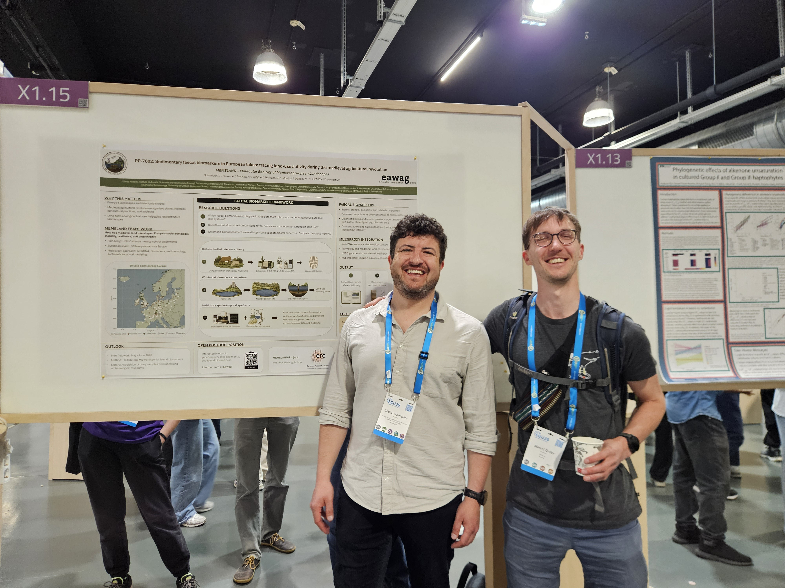

At this year’s EGU General Assembly, MEMELAND’s faecal biomarker work moved from workflow development to lively scientific exchange. [Tobi](/Team/people.qmd#dr.-tobias-schneider) presented a poster outlining our strategy for using sedimentary faecal biomarkers to trace medieval land use, grazing, and manuring across European lake archives.

The poster highlighted how sterols, stanols, bile acids, and related compounds can contribute to reconstructing human–environment interactions in medieval landscapes, especially when integrated into the broader MEMELAND multiproxy framework, including sedaDNA, pollen, sedimentology, and high-resolution core scanning approaches.

It was a pleasure to see the strong interest in this work from the wider geoscience community. Several discussions opened promising perspectives for future collaboration, particularly around fieldwork, sampling strategies, and the application of faecal biomarker approaches across different landscape settings.

EGU also provided a valuable opportunity for [Marcel](/Team/people.qmd#marcel-luciano-ortler) (right in photo) and [Tobi](/Team/people.qmd#dr.-tobias-schneider) (left in photo) to meet in person and discuss the next steps in their collaboration, with a particular focus on hyperspectral imaging and upcoming fieldwork.

[Dr. Tobias Schneider](/Team/people.qmd) and [Marcel-Luciano Ortler](/Team/people.qmd) are both listed on the MEMELAND [People page](/Team/people.qmd).

Overall, the poster session was a highly encouraging moment for the faecal biomarker component of MEMELAND. It helped refine our strategy, strengthen collaborations, and prepare for the next phase of field and laboratory work.

The EGU poster is also linked from the MEMELAND [Outputs page](/Outputs/outputs.qmd).

As an important next step, [Tobi](/Team/people.qmd#dr.-tobias-schneider) will visit and work closely with Prof. Helen Mackay at Durham University to harmonize faecal biomarker protocols and kick off an initiative towards a medieval faecal biomarker reference library.

::: {.callout-note}
## Key Information

**Date:** 05 May 2026

**Location:** Vienna, Austria
:::

{fig-align="center" fig-alt="Marcel (right) and Tobi (left) at EGU 2026 in Vienna in front of the MEMELAND faecal biomarker poster."}

: *[Marcel](/Team/people.qmd#marcel-luciano-ortler) (right) and [Tobi](/Team/people.qmd#dr.-tobias-schneider) (left) at EGU 2026 in Vienna in front of the MEMELAND faecal biomarker poster.*
