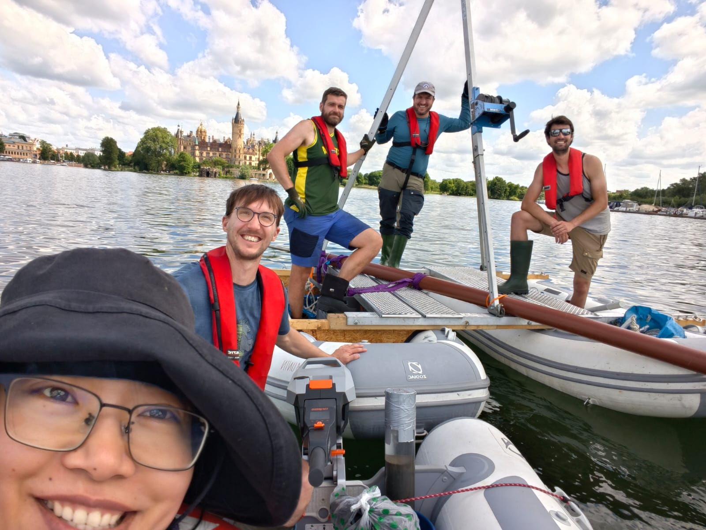

During May and June 2026, the MEMELAND team consisting of Oliver A. Kern, Ying Liu, Alois Reveret (all UiT), Marcel-Luciano Ortler (PLUS), and Tobias Schneider (Eawag), cored various lakes in Southern Sweden, Denmark, and Northern Germany. In total, 16 lakes were cored (3 in Sweden, 5 in Denmark, and 8 in Germany) over the course of 16 days using a combination of Nesje corer and Uwitec surface corer.

::: {.callout-note}
## Key Information

📅 **Date:** 18 May 2026 to 10 June 2026

🗺️ **Location:** Sweden, Denmark, Germany
:::

## Background

The goal at each lake was to retrieve sediments spanning from today to c. 2000 years before today, thereby covering the palaeoclimatic and palaeoecological developments since Roman times. In total, more than 60 metres of lake sediments were retrieved and transported to Tromsø for further processing and analyses.

## Details

Most of the lakes chosen are situated in close vicinity to Medieval high-status sites, such as abbeys or monasteries, which have a rich history including a substantial anthropogenic impact on local ecosystems from deforestation, agriculture, and animal husbandry. However, some of the lakes represent the opposite: they provide the background signal from mostly undisturbed areas with minimal human interference. By pairing these lakes with those from high-status sites, we aim to disentangle the natural baseline and the human impact within an area. An example of such a lake-pair is Mündesee (ML37 MUS) and Amtssee (ML36 AMT, located next to Chorin Abbey), located only 15 km apart.

{fig-align="center" fig-alt="The MEMELAND team after 16 busy but very successful days of coring in the Northern Europe."}

: *The MEMELAND team after 16 days of hard work. Photo: Ying Liu, UiT.*
