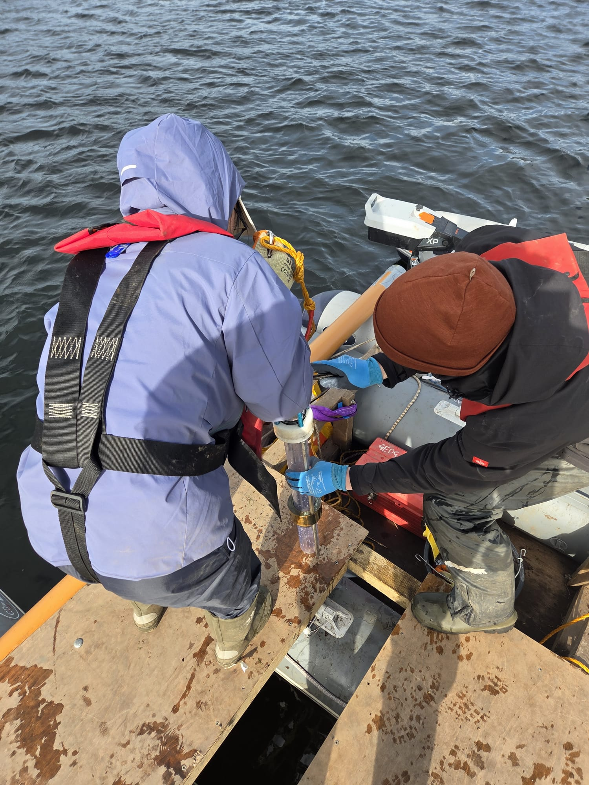

During February and March 2026, a MEMELAND team undertook a coring campaign in the United Kingdom. A total of eight lakes, one in Wales, two in England, and five in Scotland were successfully cored using a combination of Nesje coring setup and a Uwitec surface corer.

::: {.callout-note}
## Key Information

📅 **Date:** 22 February 2026 to 11 March 2026

🗺️ **Location:** UK
:::

## Background

The goal at each lake was to retrieve sediments spanning from today to c. 2000 years before today, thereby covering the palaeoclimatic and palaeoecological developments since Roman times. In total, 24.4 metres of lake sediments were retrieved, packed, and shipped to Tromsø for further processing and analyses.

## Details

Most of the lakes chosen are situated in close vicinity to Medieval high-status sites, such as abbeys or monasteries, which have a rich history including a substantial anthropogenic impact on local ecosystems from deforestation, agriculture, and animal husbandry. However, some of the lakes represent the opposite: they provide the background signal from mostly undisturbed areas with minimal human interference. By pairing these lakes with those from high-status sites, we aim to disentangle the natural baseline and the human impact within an area. An example of such a lake-pair is Lake of Menteith (ML21LMT) and Loch Venachar (ML22LVA), located only 5 km apart.

{fig-align="center" fig-alt="Lake sediment core retrieval during the MEMELAND field work campaign in the United Kingdom."}

: *Lake sediment core retrieval.*
