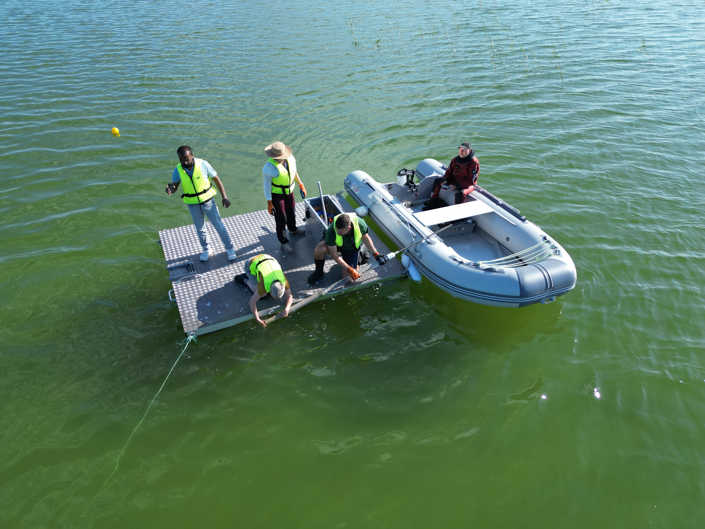
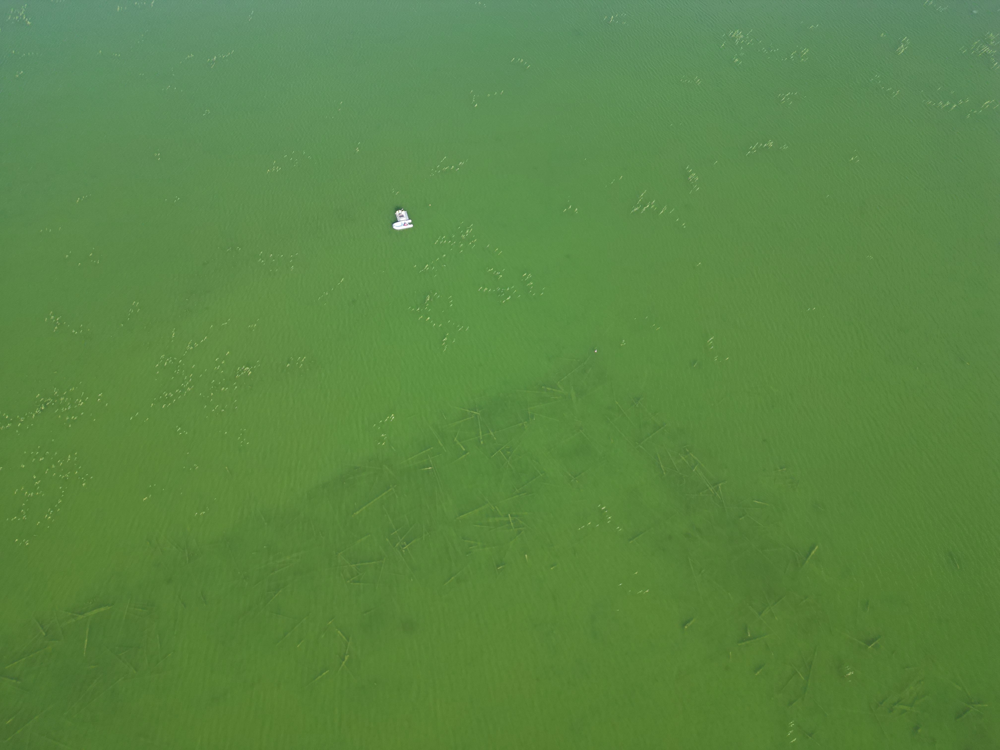

Together with the local expert, archaeologist, and diver Peter d'Agnan (University of Lund), the UiT team had the opportunity to core Tingstädeträsk on Gotland, Sweden. Tingstädeträsk is famous for the remains of a wooden bulwark (the Bulverket) in its center, which today consists of thousands of timbers and other wooden pieces scattered in the lake. Constructed in the 12th century, the Bulverket is an important piece of medieval history of the Baltic Sea region. Combined with years of archaeological excavations and expertise, we aim to unravel the ecological history and the human impact on the island of Gotland using state-of-the-art sedaDNA, imaging, and dating techniques.

::: {.callout-note}
## Key Information

📅 **Date:** 29-31 July 2026

🗺️ **Location:** Gotland, Sweden
:::

::: {layout-ncol=2}
{fig-alt="Fieldwork team during coring operations at Tingstädeträsk, Gotland, Sweden."}

{fig-alt="Fieldwork team during coring operations at Tingstädeträsk, Gotland, Sweden."}
:::

: *Photos: Peter d'Agnan.*
