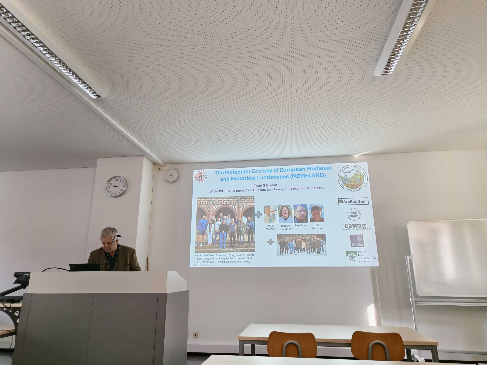

As part of the MEMELAND project, Prof. Antony Brown, Prof. Andreas Lang, and Dr. Ying Liu participated in the ninth International Landscape Archaeology Conference (LAC), held from 18 to 21 March 2026 in Bamberg, Germany.

The team presented key findings from the MEMELAND project and engaged in scholarly exchange with fellow researchers, fostering interdisciplinary discussion on palaeoenvironmental reconstruction and past landscape dynamics.

{fig-align="center" fig-alt="Prof. Antony G. Brown presenting the MEMELAND project at the International Landscape Archaeology Conference Foto: Dr. Ying Liu"}

: *Prof. Antony G. Brown presenting the MEMELAND project at the International Landscape Archaeology Conference Foto: Dr. Ying Liu*

::: {.callout-note}
## Key Information

📅 **Date:** 20 March 2026

🗺️ **Location:** Bamberg
:::
