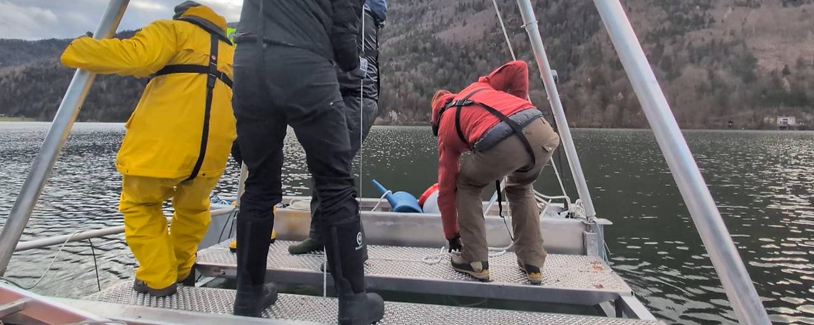

The University of Salzburg's contribution to MEMELAND was featured on ORF Salzburg in June 2026, bringing the project's research into the public spotlight.

::: {.callout-note}
## Key Information

📅 **Date:** 21 June 2026

🗺️ **Location:** Salzburg, Austria

🔗 **More info:** [ORF Salzburg feature: "Seeböden entschlüsseln Geschichte des Ackerbaus"](https://salzburg.orf.at/stories/3359419/)
:::

## Background

Understanding how medieval land use shaped European biodiversity requires precise, long-term environmental records that go beyond what written history can provide. Lake sediments offer exactly that — undisturbed archives accumulating over millennia that capture changes in vegetation, erosion, and farming intensity. The Salzburg team's work on sediment coring, catchment characterisation, and high-precision chronology is central to MEMELAND's ability to reconstruct these trajectories across the last 2,000 years.

## Details

On 21 June 2026, ORF Salzburg broadcast and published a feature on the MEMELAND project, based on interviews filmed at the University of Salzburg. Prof. Andreas Lang explained why lake beds are uniquely suited as natural archives, and how sediment cores allow researchers to trace agricultural change across millennia. David Zezula described the strict laboratory protocols required when handling ancient environmental DNA, including the use of red light to prevent sample degradation. Dr. Shuang Zhang spoke to the importance of chronological precision when matching sediment evidence against historical records — a particular challenge given the relatively short 2,000-year window the project examines.

{fig-align="center" fig-alt="Sediment core retrieval during MEMELAND fieldwork."}

: *Sediment core retrieval. Photo: Marcel Ortler / Salzburg.*

## Resources

- [ORF Salzburg feature: "Seeböden entschlüsseln Geschichte des Ackerbaus" (21 June 2026)](https://salzburg.orf.at/stories/3359419/)
