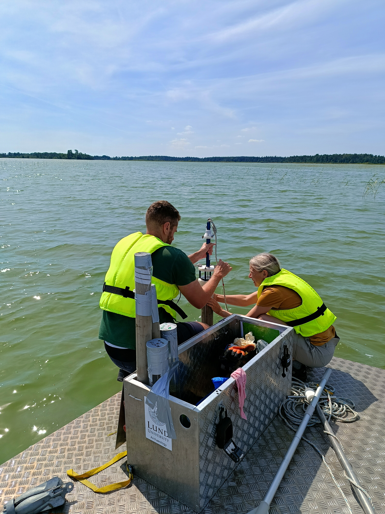

This is an exciting opportunity to join an international research team investigating the ecological history of European freshwater ecosystems using cutting-edge ancient sedimentary DNA approaches.

Application deadline: **16 August 2026**.

::: {.callout-note}
## Key Information

📅 **Date:** 3 August 2026

🗺️ **Location:** Tromso, Norway

🔗 **More info:** [Apply here by 16 August 2026](https://www.jobbnorge.no/en/available-jobs/job/303780/phd-fellow-in-ancient-sedimentary-dna-of-freshwater-fish-and-ecological-interactions-in-europe)
:::

{fig-align="center" fig-alt="Sediment core retrieval."}

: *Sediment core retrieval.*

## Resources

- [Apply here by 16 August 2026](https://www.jobbnorge.no/en/available-jobs/job/303780/phd-fellow-in-ancient-sedimentary-dna-of-freshwater-fish-and-ecological-interactions-in-europe)
